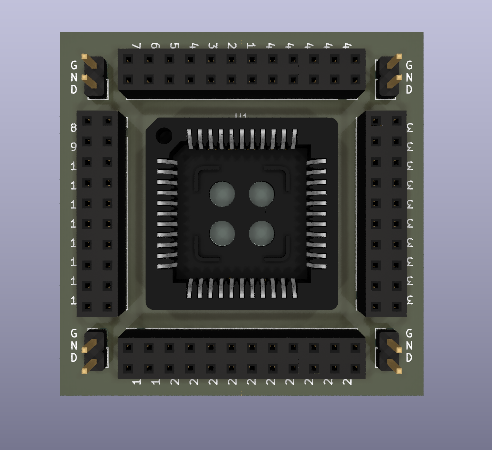
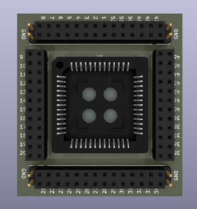
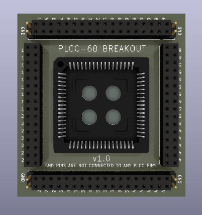
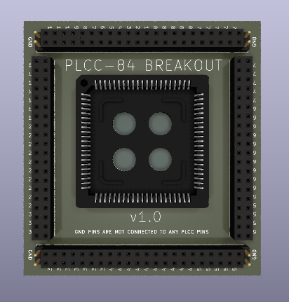

# PLCC Breakout Boards
I recently got back into designing some retro computer boards using an 8085, Z80, 68008 and 8051 chips. In order to quickly get to version 1 of a board, I needed to sort out the wiring. I created these breakout boards to allow me to patch any chip in a PLCC44, PLCC52, PLCC68 or PLCC84 package onto my memory kickstarter board (includes ROM, RAM, UART, clock, LEDs etc) to allow for rapid prototyping witout committing to a PCB design first.

There are currently 4 breakout boards.

## PLCC44 Breakout board

This is the 44 pin PLCC breakout board. Each pin on the PLCC socket is broken out into 2 pinheader (or pinsocket) contacts. There are 8 ground pins that connect to the copper pour BUT do not connect to any pins on the PLCC socket.

Please see the boards folder for the Kicad design files.

## PLCC52 Breakout board

This is the 52 pin PLCC breakout board. Each pin on the PLCC socket is broken out into 2 pinheader (or pinsocket) contacts. There are 8 ground pins that connect to the copper pour BUT do not connect to any pins on the PLCC socket.

Please see the boards folder for the Kicad design files.

## PLCC68 Breakout board

This is the 68 pin PLCC breakout board. Each pin on the PLCC socket is broken out into 2 pinheader (or pinsocket) contacts. There are 8 ground pins that connect to the copper pour BUT do not connect to any pins on the PLCC socket.

Please see the boards folder for the Kicad design files.

## PLCC84 Breakout board

This is the 84 pin PLCC breakout board. Each pin on the PLCC socket is broken out into 2 pinheader (or pinsocket) contacts. There are 8 ground pins that connect to the copper pour BUT do not connect to any pins on the PLCC socket.

Please see the boards folder for the Kicad design files.

## Version History

* 0.1
    * Initial Release

## License

This project is licensed under the GNU General Public License v3.0 - see the LICENSE.md file for details
